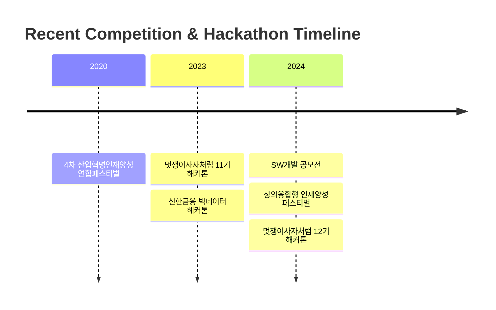

  
# 🌟 Welcome to DongSeop's GitHub 

  

## 👨‍💻 About Me
> 안녕하세요! 계명대학교 컴퓨터공학부에서 컴퓨터공학을 전공하고 있는 서동섭입니다.  
> 백엔드를 공부하고 싶지만 현재는 프론트엔드 개발을 하고 있습니다.   
> 풀스택 개발자를 목표로 열심히 공부중입니다!

  

## 🛠 Tech Stack 

### 💫 Platforms & Languages

### 🎨 Frontend

### 🛠 Tools

## 🌱 Currently Learning

  

## 🏆 Awards & Activities
<table>
    <tr>
    <td align="center">🎖</td>
    <td>2024 창의융합형 인재양성 공유-협업 페스티벌 공모전 우수상(온오프라인 스터디매칭 플랫폼)</td>
  </tr>
  <tr>
    <td align="center">🎖</td>
    <td>2024 창의융합형 인재양성 공유-협업 페스티벌 공모전 우수상(채팅 플렛폼)</td>
  </tr>
  <tr>
    <td align="center">🏅</td>
    <td>2020 4차 산업혁명인재양성 연합페스티벌 공모전 장려상</td>
  </tr>
  <tr>
    <td align="center">🦁</td>
    <td>멋쟁이 사자처럼 대학 12기 운영진 (2024.03 ~ Present)</td>
  </tr>
  <tr>
    <td align="center">🦁</td>
    <td>멋쟁이 사자처럼 대학 11기 아기사자 수료 (2023.03 ~ 2023.12)</td>
  </tr>
</table>

## 💻 Projects
### 🚀 Running Services
<table>
  <tr>
    <td>
      
    </td>
    <td>
      <b>식단 배송 서비스</b> 
      <a href="http://nimn.store/">🔗 nimn.store</a>
    </td>
  </tr>

<tr>
    <td>
      
    </td>
    <td>
      <b>업사이클링 제품 판매 및 폐기물 수거 서비스</b> 
      <a href="https://www.refresh-f5.store/">🔗 refresh-f5.store</a>
    </td>
  </tr>
</table>

### 📱 Portfolio Projects
<table>
  <tr>
    <td>
      
    </td>
    <td>
      <b>온오프라인 스터디 매칭 서비스</b> 
      <a href="https://github.com/dongsubnambuk/studymatching-smashing">🔗 GitHub Repository</a>
    </td>
  </tr>
</table>

## 📊 GitHub Stats

  

  

  

## 🏃‍♂️ Recent Activities

---

  
### 🤝 Let's Connect!

