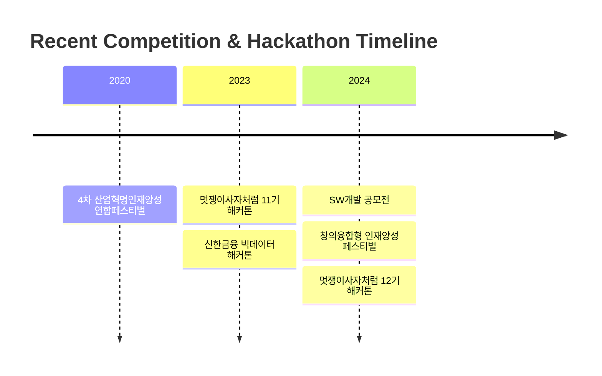

  

## 👨‍💻 About Me

<h3>열정적인 개발자, 서동섭입니다! 👋</h3>

> 🎓 계명대학교 컴퓨터공학과에서 공부하고 있습니다  
> 💻 프론트엔드부터 백엔드까지 다양한 기술에 관심이 있습니다  
> 🌱 새로운 기술을 배우고 도전하는 것을 좋아합니다  
> 💡 문제 해결을 위한 창의적인 접근을 추구합니다  
> 🤝 팀과의 협업을 통한 성장을 중요하게 생각합니다

 

  <h3>📫 Contact & Social</h3>
  

 

## 🛠 Tech Stack

  
### 💫 Primary Skills

### 🎨 Frontend Development

  
  

### ⚙️ Development Tools

  

### 📚 Currently Learning

  

## 🏆 Awards & Activities 

<table>
  <tr>
    <td width="70">
      
    </td>
    <td>
      <strong>2024 창의융합형 인재양성 공유-협업 페스티벌 공모전 우수상</strong>
       
      • 온오프라인 스터디매칭 플랫폼 개발
       
      • 실시간 채팅 플랫폼 구현
    </td>
  </tr>
  <tr>
    <td>
      
    </td>
    <td>
      <strong>2020 4차 산업혁명인재양성 연합페스티벌 공모전 장려상</strong>
       
      • C언어기반 간단 게임프로그램
    </td>
  </tr>
  <tr>
    <td>
      
    </td>
    <td>
      <strong>멋쟁이 사자처럼</strong>
       
      • 12기 운영진 (2024.03 ~ Present)
       
      • 11기 아기사자 수료 (2023.03 ~ 2023.12)
    </td>
  </tr>
</table>

## 💻 Projects

<table>
<tr>
<td width="33.3%">
<h3 align="center">🍽️ 식단 배송 서비스</h3>

 

<strong>React, Spring Boot, MySQL</strong> - 맞춤형 식단 배송 서비스 플랫폼

<ul>
  <li>주문 하기 및 결제</li>
  <li>AI기반 식단 생성</li>
</ul>
</td>
<td width="33.3%">
<h3 align="center">♻️ 업사이클링 제품 판매 서비스</h3>

 

<strong>React, Spring, MongoDB</strong> - 환경 친화적 업사이클링 제품 거래 플랫폼

<ul>
  <li>실시간 결제 시스템 구현</li>
  <li>위치 기반 폐기물 수거 서비스</li>
</ul>
</td>
  <td width="33.3%">
<h3 align="center">온오프라인 스터디 매칭 플랫폼</h3>

 

<strong>ReactVative, FireBase</strong> - 효율적인 스터디 관리

<ul>
  <li>온오프라인 스터디 생성 및 참여</li>
  <li>위치 기반 스터디 생성</li>
</ul>
</td>
</tr>
</table>

## 📈 Competitive Programming & Timeline

## 📊 GitHub Statistics

<table>
<tr>
<td width="50%">

</td>
<td width="50%">

</td>
</tr>
</table>

## 🌟 Top Repositories

---

  
  

